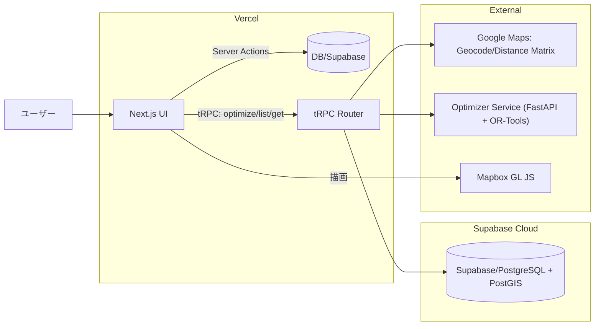
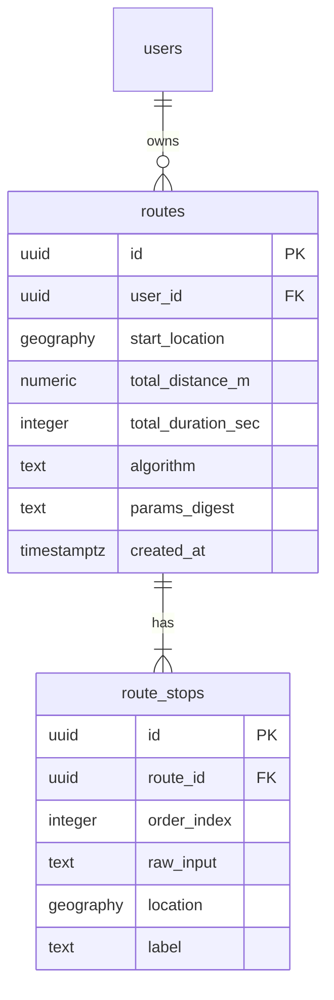

# RouteKun 設計ドキュメント（MVP／TDD駆動・コード例なし）

本書は docs/Prompt.md の要件に基づき、TypeScript を中核としたモダンな技術スタックで小規模ビジネス向けのルート最適化 Web アプリ「RouteKun」を設計する。TDD（Red → Green → Refactor）を前提に、アーキテクチャ、データモデル、品質・運用方針を一貫して定義する。

---

## 1) エグゼクティブサマリ

- 製品概要: 配送・訪問計画の巡回ルート（TSP）を最適化し、地図可視化と履歴管理を提供する Web アプリ。
- 価値提案: 入力（住所リスト）から最短巡回順序・距離・所要時間を即時提示。UI/UX、型安全、観測性と運用容易性を重視。
- ターゲット: 1 日 10〜30 件程度の配送やアポイントを持つ小規模事業者・営業担当。
- MVP 機能: 住所入力、最適化計算（Python/OR-Tools 連携）、地図可視化（Mapbox）、結果表示、履歴保存（Supabase）、レスポンシブ対応。
- 成功指標: p95 最適化時間（20 ストップ）< 1.5s、直感的操作、繰り返し利用率、エラー率低減。
- スコープ外（MVP 以降）: 時間窓制約、車両・容量制約、複数車両 VRP、優先度・締切マネジメント、高度な共有・エクスポート。

---

## 2) 技術選定とトレードオフ

- Next.js 14（App Router, RSC, Server Actions）
  - 理由: 速度・DX・SSR/SSG の柔軟性。RSC によるデータ取得最適化。Server Actions でフォームとサーバ処理を簡潔に統合。
  - トレードオフ: RSC とクライアントの責務分離に学習コスト。Server Actions は長時間処理に不向き（別 API 経由が適切）。

- tRPC（型安全 RPC）
  - 理由: 型でエンドツーエンドを貫通（Zod 連携）。API 定義と実装の乖離を抑制。
  - 使い分け: Server Actions = フォーム投稿・軽量保存・簡易バリデーション。tRPC = 最適化実行・履歴参照などのアプリ API。

- Supabase/PostgreSQL + PostGIS
  - 理由: 型生成（supabase gen types）、認証・RLS・ストレージ一体のマネージド DB。PostGIS による空間クエリ・インデックス。
  - トレードオフ: 専用 ORM（Drizzle）は採用せず SDK+型生成で十分。学習コストは低いが RLS 設計は要注意。

- 距離・地図: Google Maps Platform（ジオコーディング・Distance Matrix）、Mapbox GL JS（描画）
  - 理由: Google の距離行列精度とスケール、Mapbox の描画自由度と UI 性能を両立。
  - 使い分け: Google = 座標化・距離時間計算、Mapbox = ルート描画・ピン表示。

- 最適化エンジン: Python 3.11 + OR-Tools（FastAPI・HTTP/JSON）
  - 理由: Node 公式バインディング非提供。Python は OR-Tools 一級サポート。HTTP/JSON による疎結合・運用容易性。
  - トレードオフ: サービス分割の運用コスト増。対策としてシンプルな契約・リトライ・タイムアウト・ヘルスチェックを実装。

- バリデーション/スキーマ: Zod（API・環境変数・フォーム）
- テスト: Vitest（単体/統合）、Testing Library、MSW（モック）、fast-check（性質ベース）、Playwright（E2E・a11y）
- モノレポ: pnpm + Turborepo（キャッシュ・分割・開発速度）

---

## 3) システム構成・データフロー

- リクエストライフサイクル（最適化）
  1) 住所リスト入力（UI → Server Action で下書き保存・検証）
  2) UI → tRPC `route.optimize` 呼び出し
  3) tRPC で Google によるジオコーディング・距離行列取得（キャッシュ活用）
  4) tRPC → Optimizer（HTTP/JSON）で TSP 解（順序）を取得
  5) tRPC が結果を DB 保存 → UI に返却
  6) UI は Mapbox でピン・経路線描画、距離・時間を表示

---

## 4) モノレポ構成（最小）

- apps/web: Next.js アプリ（RSC/Server Actions、UI、tRPC クライアント）
- packages/api: tRPC ルーター・スキーマ（Zod 参照）
- packages/supabase: Supabase クライアント初期化・型（自動生成取込）
- packages/domain: ドメイン（住所正規化、入力検証、ビジネスルール）
- packages/optimizer-client: Optimizer サービス HTTP クライアント（契約）
- packages/ui: 共通 UI（デザインシステムの核）
- services/optimizer-py: FastAPI + OR-Tools 実装
- e2e: Playwright テスト

---

## 5) スキャフォールド手順（TDD 前提）

- 最初に失敗する E2E を用意（住所入力 → 最適化開始 → 地図で順番付きピン表示）。
- ワークスペース基本コマンド: 依存導入、型チェック、単体/統合/ E2E 実行、開発サーバ起動。
- 重要ガードレール: 全ての新規ロジックは Red→Green→Refactor サイクルを踏む。API 契約は Zod で固定し先にテスト化。

---

## 6) コア設計ポイント（コード例なし）

- 入力バリデーション: 住所リスト（1 行 1 件、最低 2 件＋出発地）・重複削除・空行除去・最大件数（MVP: 30）。
- 距離行列: Google Distance Matrix を同期取得。キー（出発地/目的地/時刻）で Supabase にキャッシュ（TTL 24h）。
- 最適化契約（Optimizer）
  - JSON キーは FastAPI 実装に合わせて snake_case（`origin` / `destinations` / `distance_matrix` / `options` / `diagnostics`）で固定。packages/optimizer-client は TypeScript では camelCase（`fallbackTolerance` など）を公開し、送受信時に自動変換して差異を吸収する。
  - リクエスト JSON

    | Key | 型 / 制約 | 説明 |
    | --- | --- | --- |
    | `origin` | `Coordinates` `{ lat: number; lng: number }`（-90 ≦ lat ≦ 90, -180 ≦ lng ≦ 180） | 出発地（WGS84）。 |
    | `destinations` | `DestinationStop[]`（1〜30 件）各要素 `{ id: string; lat: number; lng: number; label?: string }` | 最適化対象の停留所。`id` は visit_order で再利用する安定 ID。 |
    | `distance_matrix` | 任意。`{ meters: number[][]; seconds: number[][] }`。行・列とも `origin + destinations` の順で同一サイズ、全要素 >= 0。 | Google Distance Matrix キャッシュをそのまま渡す。欠損時は Optimizer（または tRPC）がハバーサイン近似で代替。 |
    | `options` | `OptimizerOptions`。省略時は defaults。 | 下表参照。 |

    `Coordinates` / `DestinationStop` / `DistanceMatrix` は Zod でも同じ制約を持ち、shape 検証（row/column 数が一致すること）を tRPC 側でも実施する。

  - レスポンス JSON

    | Key | 型 | 説明 |
    | --- | --- | --- |
    | `route_id` | `string`（UUID v4） | Optimizer が発行する計算 ID。 |
    | `visit_order` | `string[]` | `destinations[i].id` の順序リスト。 |
    | `ordered_stops` | `OrderedStop[]` | 下表の構造体。 |
    | `total_distance_m` | `number`（int, >= 0） | 全経路の合計距離（m）。 |
    | `total_duration_s` | `number`（int, >= 0） | 全経路の合計時間（s）。 |
    | `diagnostics` | `Diagnostics` | 解法の詳細（下表）。 |

    `OrderedStop` 要素は `{ id, label?, lat, lng, sequence, distance_from_previous_m, duration_from_previous_s, cumulative_distance_m, cumulative_duration_s }` を返し、UI/DB がそのまま利用できる。`Diagnostics` は `{ strategy: "fast" \| "quality", solver: string, iterations: number, gap: number (0-1), fallback_used: boolean, execution_ms: number }`。

  - `options` パラメータ（TypeScript 側 / ワイヤーフォーマットの両方を明記）

    | クライアント側キー | ワイヤーキー | 型・範囲 | デフォルト | 振る舞い |
    | --- | --- | --- | --- | --- |
    | `strategy` | `strategy` | `"fast"` or `"quality"` | `"quality"` | `fast`: 近傍+局所探索で 10s 以内に収束、迭代数を 1k 付近に制限。`quality`: OR-Tools meta-heuristic を想定し 30s / 4k iteration まで粘る。 |
    | `maxIterations` | `max_iterations` | `number` 10〜10,000 | 4,000 | Solver 側の iteration 上限。`fast` は 1,500 に丸める。 |
    | `maxRuntimeSeconds` | `max_runtime_seconds` | `number` 1〜60 | 30 | 1 リクエスト当たりの計算時間上限。tRPC 側 budget（45s）に収まるよう 30s で固定。 |
    | `fallbackTolerance` | `fallback_tolerance` | `number` 0.0〜1.0 | 0.15 | `diagnostics.gap` がこの閾値を超える、または Solver が `fallback_used` を true で返した場合は tRPC が近傍法フォールバックを採用し UI へ通知。 |

- 可視化: Mapbox に GeoJSON を渡し、順序番号ピン・折れ線で描画。モバイル最適化（パン・ピン密度）。
- 永続化: `routes` と `route_stops` に最適化結果を保存、再現可能性確保（入力スナップショットも保持）。
- エラーハンドリング: Google Geocode 6s / Distance Matrix 10s / Optimizer 30s のタイムアウト・429/5xx を捕捉し、必要に応じて最近傍法フォールバックとリトライ結果を UI に通知。UI は非同期状態・再試行 UX を標準化。
- 外部 API タイムアウト / リトライ

  | サービス | リクエストタイムアウト | リトライ & バックオフ | 方針 |
  | --- | --- | --- | --- |
  | Google Geocode API | 6s | 最大 2 回。指数バックオフ 0.5s → 1.5s（+10% ジッター）。4xx はリトライしない。 | 住所正規化は fail-fast で UX を守る。6s×3 回でも 18s 未満。 |
  | Google Distance Matrix API | 10s | 最大 2 回。1s → 3s バックオフ（+ジッター）。429/5xx/Timeout のみリトライ。 | 目的地数に比例して遅延が伸びるため少し長め。E2E バジェット 30s 以内。 |
  | Optimizer サービス | 30s | 最大 3 回。1s → 2s → 4s。失敗時は即座に近傍法フォールバックを返却。 | OR-Tools 版でも 30s を超えないよう `max_runtime_seconds` を固定。 |

---

## 7) データモデルと API 契約（要点）

- routes
  - id, user_id, created_at, start_location (geography Point), total_distance_m, total_duration_sec, algorithm, params_digest
- route_stops
  - id, route_id, order_index, raw_input, location (geography Point), label
- distance_cache
  - id, key_hash, matrix_json, created_at, ttl_expire_at
- users（Supabase Auth 連携）

- tRPC ルート
  - route.optimize: 入力検証 → 距離行列取得/キャッシュ → Optimizer 呼び出し → DB 保存 → 結果返却
  - route.list: 直近のルート概要をページングで返却
  - route.get: ルート詳細（ stops を含む）返却

- Zod スキーマ（方針）
  - 入力: 出発地（住所/座標）、目的地リスト（住所/座標）、最適化オプション
  - 出力: 訪問順序、距離/時間、GeoJSON 相当の構造化データ

- RLS 方針
  - routes/route_stops は `user_id = auth.uid()` のみ参照・作成可。distance_cache はサービスロール限定。

---

## 8) テスト戦略（TDD 詳細）

- ピラミッド: 単体（Zod/ドメイン）＞統合（tRPC + MSW）＞E2E（Playwright）
- fast-check（性質）
  - 最適化結果は入力全停留所を1度ずつ含む
  - 近傍法フォールバック ≤ 距離上限（ナイーブ順）
  - 入力正規化後の件数・重複特性保持
- E2E
  - 住所入力 → エラー表示（空/不正）
  - 最適化完了 → 地図ピン順序・合計距離表示
  - モバイル幅での UI 可視性・操作性
- a11y: 自動スキャンとキーボード操作可能性の最小 AC を担保

---

## 9) CI/CD

- GitHub Actions: typecheck, lint, unit/integration, e2e, build を分離実行（Node 20 + pnpm キャッシュ）。
- Supabase 型生成を CI で検証（スキーマ差分チェッカー導入）。
- Optimizer サービスは別ジョブでヘルスチェック・契約整合テスト（MSW 併用）。

---

## 10) 運用・観測性

- メトリクス: p95 最適化時間、Google API 呼数/失敗率、Optimizer タイムアウト率、距離キャッシュヒット率、DB クエリ時間。
- ログ: ルーティング ID 単位の相関 ID 付与。Optimizer 入出力はサイズ制限下でサマリを記録。
- トレース: Next.js → tRPC → 外部 API の分散トレース（オプション）。
- SLO: p95（20 stops）< 1.5s、失敗率 < 1%。SLA 逸脱でアラート。

---

## 11) セキュリティ

- 入力検証と出力エスケープの徹底（Zod + UI サニタイズ）。
- レート制限: 最適化 API をユーザーごとに短時間の上限設定。
- API キー管理
  - Google Maps: サーバーサイドのみ（非公開）。
  - Mapbox: `NEXT_PUBLIC_MAPBOX_TOKEN`（ドメイン制限）。
  - Supabase: anon（RLS 保護）/ service role（サーバー限定）。
- RLS: 自ユーザーのみが自データ参照/更新。監査ログ（重要操作）。

---

## 12) パフォーマンス戦略

- キャッシュ: 距離行列（TTL 24h）、最適化結果（入力ダイジェスト単位）。
- タイムアウト/リトライ: Optimizer 30s タイムアウト、指数バックオフ。失敗時は近傍法フォールバックで可用性優先。
- フロント: 重要情報のストリーミング表示、地図の遅延ロード、モバイル最適化。
- DB: PostGIS 空間インデックス、ページング、N+1 抑止。

---

## 13) README（最小実行手順・環境変数）

- 必須環境変数
  - NEXT_PUBLIC_MAPBOX_TOKEN（クライアント）
  - GOOGLE_MAPS_API_KEY（サーバー）
  - SUPABASE_URL / SUPABASE_ANON_KEY / SUPABASE_SERVICE_ROLE_KEY（サーバー専用は公開不可）
  - DATABASE_URL（PostgreSQL）
  - OPTIMIZER_SERVICE_URL（FastAPI）
- 起動: 依存インストール → 型生成同期 → 単体/統合テスト → E2E → 開発サーバ。外部サービスはスタブ（MSW）で TDD 回せる設計。

---

## 14) ロードマップ（2〜4 週間）

- Week 1: モノレポ初期化、型生成パイプライン、住所入力・バリデーション（Red→Green）、距離キャッシュ設計、E2E 初動。
- Week 2: Optimizer クライアント契約確定、MSW モック、最適化フロー（tRPC）実装、結果保存、基本 UI/地図描画。
- Week 3: 観測性・レート制限・RLS 仕上げ、a11y/E2E 安定化、キャッシュ・フォールバック導入、パフォーマンス計測。
- Week 4: 仕上げ（UX 改善・モバイル最適化）、ドキュメント整備、デプロイ、運用監視基盤。

---

## 付録）ミニマム TDD サンプル（シナリオ記述のみ）

- 住所リストのバリデーション
  - 空行のみ → エラー表示
  - 2 件未満 → エラー（最短でも出発地+1）
  - 重複住所 → 正規化後に一意

- 地図可視化のレスポンシブ（モバイル）
  - 画面幅 375px でピン番号とルート線が視認可能
  - ズーム・パンの初期状態が適切（全停留所が入る）

- 最適化契約の整合
  - tRPC 入出力が Zod と一致
  - Optimizer タイムアウト時のフォールバックが発動し UI に通知
